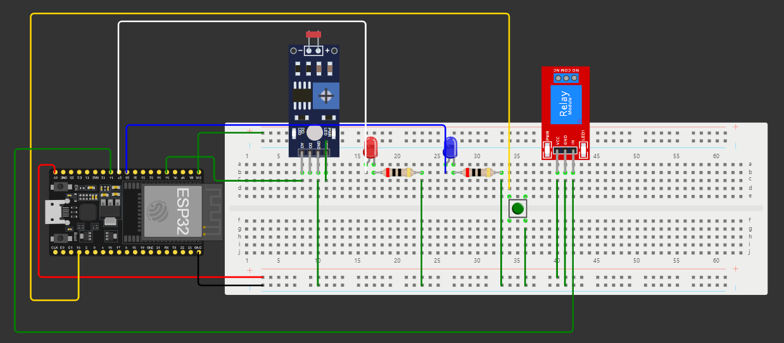

# Documentação do Projeto: Controle de LEDs e Relé com MQTT

## **Visão Geral**
Este projeto utiliza um ESP32 para criar um sistema de automação que:
- Lê o valor de um sensor LDR (resistor dependente de luz) para determinar a intensidade da luz ambiente.
- Controla dois LEDs (azul e vermelho) com base no valor lido do LDR.
- Publica os dados do LDR e o estado dos LEDs em um tópico MQTT.
- Controla manualmente um relé utilizando um botão de pressão.

## **Componentes Utilizados**
1. **Microcontrolador**: ESP32
2. **Sensor LDR**: Para medir a intensidade da luz ambiente.
3. **LEDs**:
   - Azul: Indicativo de alta luminosidade.
   - Vermelho: Indicativo de baixa luminosidade.
4. **Relé**: Ativado manualmente via botão.
5. **Botão de Pressão**: Controla o estado do relé.
6. **Conexão Wi-Fi**: Para publicação dos dados no servidor MQTT.

## **Funcionalidades**
### **1. Conexão Wi-Fi e MQTT**
- O ESP32 conecta-se a uma rede Wi-Fi usando as credenciais fornecidas.
- Estabelece conexão com o broker MQTT em `broker.hivemq.com`.
- Publica mensagens no tópico MQTT: `villa_lobos/tree_status`.

### **2. Leitura do Sensor LDR**
- Mede continuamente o valor analógico do LDR.
- Atualiza o valor a cada 1 segundo usando a função `millis()` para evitar o uso de `delay()`.

### **3. Controle de LEDs**
- Se o valor do LDR for maior que 2048 (50% do intervalo do ADC):
  - O LED azul é ativado.
  - O LED vermelho é desativado.
  - Publica "LED Azul ligado" no tópico MQTT.
- Caso contrário:
  - O LED vermelho é ativado.
  - O LED azul é desativado.
  - Publica "LED Vermelho ligado" no tópico MQTT.

### **4. Controle do Relé**
- Um botão de pressão controla o relé:
  - Quando pressionado, o relé é ativado e imprime "Relé ativado!" no monitor serial.
  - Quando não pressionado, o relé permanece desativado.

### **5. Publicação de Dados no MQTT**
- O valor do LDR é publicado no tópico MQTT em intervalos regulares.
- O estado dos LEDs (ligado/desligado) também é publicado.

## **Código Explicado**
### **Declarações Iniciais**
- Definição dos pinos do ESP32 para o LDR, LEDs, botão e relé.
- Configurações de Wi-Fi e MQTT (SSID, senha e servidor MQTT).

### **Classe ButtonRelayControl**
- Responsável por controlar o botão e o relé.
- Verifica continuamente o estado do botão e atualiza o estado do relé.

### **Funções Principais**
1. **`setupWiFi()`**:
   - Conecta o ESP32 à rede Wi-Fi e imprime o endereço IP no monitor serial.

2. **`reconnect()`**:
   - Reestabelece a conexão com o broker MQTT caso seja desconectado.

3. **`setup()`**:
   - Configura os pinos do ESP32.
   - Estabelece conexão com Wi-Fi e MQTT.

4. **`loop()`**:
   - Mantém a conexão MQTT.
   - Lê o valor do LDR e controla os LEDs.
   - Publica os dados no tópico MQTT.
   - Verifica o estado do botão e controla o relé.

## **Fluxo de Execução**
1. **Inicialização**:
   - Conexão ao Wi-Fi e ao broker MQTT.
2. **Loop Principal**:
   - Leitura do LDR e publicação dos dados no MQTT.
   - Controle do estado dos LEDs.
   - Verificação do botão e controle do relé.

## **Topologias e Pinos**
- **LDR**: Pino 34 (entrada analógica).
- **LED Azul**: Pino 26 (saída digital).
- **LED Vermelho**: Pino 27 (saída digital).
- **Botão**: Pino 15 (entrada digital com PULLDOWN).
- **Relé**: Pino 14 (saída digital).
