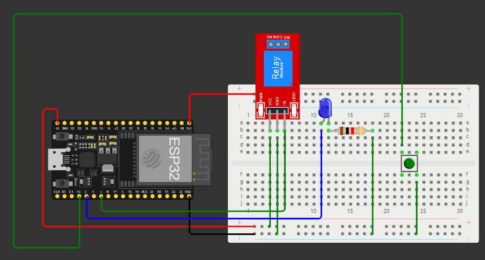

# **Documentação do Projeto: Sistema de Automação com ESP32**



#### **Descrição**
Este projeto implementa um sistema de automação utilizando um **ESP32** para controlar um dispositivo elétrico (simulado com um LED) por meio de um módulo **relé**. Um botão é usado para ativar e desativar o sistema, e o código implementa lógica de **debounce** para evitar múltiplos acionamentos indesejados causados por ruídos no botão.

---

### **Objetivos**
1. Criar um protótipo de automação que simule o controle de um dispositivo elétrico.
2. Utilizar um relé para ligar e desligar o dispositivo elétrico, representado por um LED.
3. Implementar debounce no botão para garantir um acionamento confiável.
4. Simular o circuito no **Wokwi**.

---

### **Requisitos**
1. **Hardware:**
   - ESP32.
   - Módulo relé.
   - Botão.
   - LED.
   - Resistor de **10kΩ** para pull-up externo no botão (opcional, pois o código utiliza **INPUT_PULLUP** interno).
   - Resistor de **220Ω** para o LED.

2. **Software:**
   - Plataforma Arduino IDE.
   - Simulador Wokwi para testes virtuais.

---

### **Funcionamento do Sistema**
1. **Comportamento do Botão:**
   - **Pressionado:** O ESP32 ativa o relé e acende o LED.
   - **Solto:** O ESP32 desativa o relé e apaga o LED.
2. **Debounce:**
   - Implementado para evitar múltiplos acionamentos devido a ruídos do botão.
3. **Mensagens no Monitor Serial:**
   - O estado do sistema é exibido no monitor serial para depuração.

---

### **Esquema do Circuito**

#### **Conexões**
1. **ESP32 e Botão:**
   - Um terminal do botão conectado ao **GPIO 15**.
   - Outro terminal conectado ao **GND**.

2. **ESP32 e Relé:**
   - Pino **IN** do módulo relé conectado ao **GPIO 4**.
   - **VCC** do relé conectado ao **3.3V**.
   - **GND** do relé conectado ao **GND**.

3. **ESP32 e LED:**
   - Anodo (positivo) do LED conectado ao **GPIO 2** através de um resistor de **220Ω**.
   - Catodo (negativo) conectado ao **GND**.

---

### **Código do Projeto**

```cpp
#include <Arduino.h>

// Definição dos pinos
#define BUTTON_PIN 15
#define RELAY_PIN 4
#define LED_PIN 2

// Variáveis para debounce
unsigned long lastDebounceTime = 0; // Último tempo de mudança
unsigned long debounceDelay = 50;  // Delay para debounce (50 ms)
bool buttonState = false;          // Estado atual do botão
bool lastButtonState = false;      // Estado anterior do botão

void setup() {
  // Configuração dos pinos
  pinMode(BUTTON_PIN, INPUT_PULLUP); // Ativa o resistor de pull-up interno
  pinMode(RELAY_PIN, OUTPUT);
  pinMode(LED_PIN, OUTPUT);

  // Inicialização do Serial Monitor
  Serial.begin(115200);
  Serial.println("Sistema de Automação Iniciado!");
}

void loop() {
  // Leitura do estado do botão
  bool reading = digitalRead(BUTTON_PIN);

  // Verifica se o botão mudou de estado (para debounce)
  if (reading != lastButtonState) {
    lastDebounceTime = millis(); // Atualiza o tempo de debounce
  }

  // Verifica se o tempo de debounce passou
  if ((millis() - lastDebounceTime) > debounceDelay) {
    // Se o estado do botão mudou
    if (reading != buttonState) {
      buttonState = reading;

      // Verifica se o botão está pressionado
      if (buttonState == LOW) {
        digitalWrite(RELAY_PIN, HIGH); // Ativa o relé
        digitalWrite(LED_PIN, HIGH);  // Acende o LED
        Serial.println("Relé e LED ativados!");
      } else {
        digitalWrite(RELAY_PIN, LOW); // Desativa o relé
        digitalWrite(LED_PIN, LOW);  // Apaga o LED
        Serial.println("Relé e LED desativados!");
      }
    }
  }

  // Salva o estado atual do botão como o estado anterior
  lastButtonState = reading;
}
```

---

### **Explicação do Código**

#### **1. Setup**
No método `setup()`:
- Os pinos do botão, relé e LED são configurados.
- O botão é configurado como **INPUT_PULLUP**, ativando um resistor interno de pull-up no ESP32.
- O monitor serial é iniciado para debug.

#### **2. Loop**
No método `loop()`:
1. **Leitura do Botão:**
   - O estado do botão é lido com `digitalRead()`.
2. **Debounce:**
   - Usa a variável `lastDebounceTime` para ignorar leituras de botão que ocorrem muito rapidamente (dentro de 50 ms).
3. **Controle do Relé e LED:**
   - Se o botão estiver **pressionado** (`LOW`), o relé e o LED são ativados.
   - Se o botão estiver **solto** (`HIGH`), o relé e o LED são desativados.

#### **3. Mensagens no Monitor Serial**
O monitor serial exibe mensagens indicando o estado do sistema:
- **Relé e LED ativados!**
- **Relé e LED desativados!**
