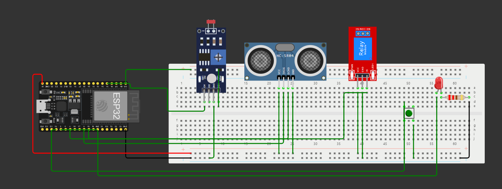

# **Sistema de Iluminação Inteligente**




#### **Objetivo**
O objetivo deste código é implementar um sistema de iluminação inteligente que:
1. **Controla LEDs e um relé** com base em:
   - A luminosidade ambiente medida por um sensor LDR.
   - A distância de objetos detectada por um sensor ultrassônico.
2. Permite **desativar manualmente o sistema** através de um botão.
3. Utiliza **POO (Programação Orientada a Objetos)** e **ponteiros** para organizar a lógica e permitir flexibilidade na configuração.

---

#### **Estrutura do Código**

O código é organizado em uma classe chamada `SistemaIluminacaoInteligente`, que encapsula a lógica do sistema. Abaixo estão os componentes e funcionalidades detalhados:

---

### **1. Classe: SistemaIluminacaoInteligente**

A classe contém:
- **Atributos privados:**
  - Ponteiros para pinos dos sensores e atuadores (`pinoLDR`, `pinoTrig`, etc.).
  - Ponteiros para os limites de operação (`limiarLDR` e `limiarDistancia`).
  - Estados internos (`sistemaAtivo` e `ultimaAtualizacao`).

- **Métodos públicos:**
  - `iniciar()`: Configura os pinos e inicializa o sistema.
  - `obterDistancia()`: Calcula a distância com o sensor ultrassônico.
  - `verificarBotao()`: Verifica o estado do botão para desativar o sistema.
  - `atualizar()`: Lê os sensores e controla os atuadores (LED e relé) com base na lógica definida.

---

#### **1.1 Atributos**
```cpp
int *pinoLDR, *pinoTrig, *pinoEcho, *pinoRele, *pinoBotao, *pinoLED;
const int *limiarLDR;
const int *limiarDistancia;
bool sistemaAtivo;
unsigned long ultimaAtualizacao;
```

- **Ponteiros para pinos:** Configuram os sensores e atuadores (ex.: `pinoLDR` para o sensor LDR).
- **Ponteiros para limites:** Definem os valores máximos para o LDR e a distância mínima.
- **`sistemaAtivo`:** Controla se o sistema está ligado ou desligado.
- **`ultimaAtualizacao`:** Registra o tempo da última execução, usado com `millis()` para controle eficiente.

---

#### **1.2 Construtor**
```cpp
SistemaIluminacaoInteligente(int *ldr, int *trig, int *echo, int *rele, int *botao, int *led, const int *limiarLDR, const int *limiarDistancia)
```

- Recebe os ponteiros dos pinos e limites como parâmetros.
- Inicializa os atributos internos da classe.

---

#### **1.3 Métodos Públicos**

##### **1.3.1 iniciar()**
Configura os pinos do ESP32 e inicializa a comunicação serial.

```cpp
void iniciar() {
  pinMode(*pinoLDR, INPUT);
  pinMode(*pinoTrig, OUTPUT);
  pinMode(*pinoEcho, INPUT);
  pinMode(*pinoRele, OUTPUT);
  pinMode(*pinoBotao, INPUT_PULLUP);
  pinMode(*pinoLED, OUTPUT);
  Serial.begin(115200);
  Serial.println("Sistema iniciado com POO e Ponteiros!");
}
```

---

##### **1.3.2 obterDistancia()**
Calcula a distância em centímetros com base no sensor ultrassônico.

```cpp
long obterDistancia() {
  digitalWrite(*pinoTrig, LOW);
  delayMicroseconds(2);
  digitalWrite(*pinoTrig, HIGH);
  delayMicroseconds(10);
  digitalWrite(*pinoTrig, LOW);
  long duracao = pulseIn(*pinoEcho, HIGH);
  return duracao * 0.034 / 2;
}
```

---

##### **1.3.3 verificarBotao()**
Verifica se o botão foi pressionado para desativar manualmente o sistema.

```cpp
void verificarBotao() {
  if (digitalRead(*pinoBotao) == LOW) {
    sistemaAtivo = false;
    digitalWrite(*pinoRele, LOW);
    digitalWrite(*pinoLED, LOW);
    Serial.println("Sistema desativado manualmente!");
    delay(500);
  }
}
```

---

##### **1.3.4 atualizar()**
Atualiza o estado do sistema, lê os sensores e controla os atuadores.

```cpp
void atualizar() {
  unsigned long tempoAtual = millis();
  if (tempoAtual - ultimaAtualizacao >= 500) {
    ultimaAtualizacao = tempoAtual;

    if (sistemaAtivo) {
      int valorLDR = analogRead(*pinoLDR);
      long distancia = obterDistancia();

      Serial.print("Valor do LDR: ");
      Serial.println(valorLDR);
      Serial.print("Distância: ");
      Serial.print(distancia);
      Serial.println(" cm");

      if (valorLDR < *limiarLDR && distancia < *limiarDistancia) {
        digitalWrite(*pinoLED, HIGH);
        digitalWrite(*pinoRele, HIGH);
        Serial.println("LEDs e Relé ativados!");
      } else {
        digitalWrite(*pinoLED, LOW);
        digitalWrite(*pinoRele, LOW);
        Serial.println("LEDs e Relé desativados!");
      }
    }
  }
}
```

---

### **2. Funções Principais**

#### **2.1 setup()**
Chama o método `iniciar()` da classe para configurar o sistema.

```cpp
void setup() {
  sistemaInteligente.iniciar();
}
```

---

#### **2.2 loop()**
Executa continuamente a verificação do botão e a lógica de atualização.

```cpp
void loop() {
  sistemaInteligente.verificarBotao();
  sistemaInteligente.atualizar();
}
```

---

### **Funcionamento do Sistema**

1. **Inicialização:**
   - O sistema configura os pinos e inicia o monitoramento dos sensores e atuadores.
   - É exibida uma mensagem no Serial Monitor indicando que o sistema foi iniciado.

2. **Monitoramento e Controle:**
   - A cada 500 ms, os valores do **LDR** e do **sensor ultrassônico** são lidos.
   - O LED e o relé são ativados se:
     - A luz ambiente está abaixo do limite configurado.
     - Um objeto está próximo (distância menor que o limite).

3. **Desativação Manual:**
   - Pressionar o botão desativa manualmente o sistema, desligando o LED e o relé.

4. **Mensagens no Serial Monitor:**
   - O estado do sistema, valores dos sensores e mudanças de estado são exibidos para debug.

---

### **Vantagens do Código**
1. **Organização com POO:**
   - Facilita a leitura e manutenção.
   - Encapsula a lógica do sistema em uma única classe.

2. **Uso de Ponteiros:**
   - Permite flexibilidade na configuração dos pinos e limites.
   - Possibilita alterar os valores facilmente fora da classe.

3. **Eficiência com `millis()`:**
   - Elimina o uso de `delay()`, permitindo que outras funções sejam executadas simultaneamente.
